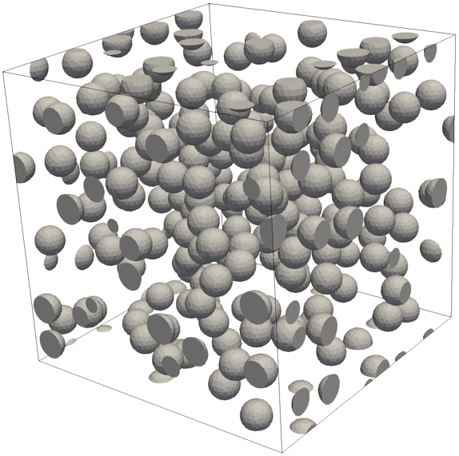
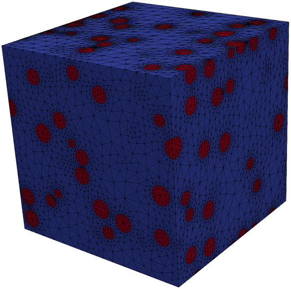

.. gmshModel documentation master file, created by
   sphinx-quickstart on Thu Apr 16 21:45:42 2020.
   You can adapt this file completely to your liking, but it should at least
   contain the root `toctree` directive.

GmshModel
=========
`Gmsh <https://gmsh.info/>`_ is a powerful tool for the generation of meshes for 
numerical simulations but the built-in scripting language makes the meshing
procedure and especially an automatization really hard. Luckily, Gmsh provides 
a Python-API with which all the capabilites of Gmsh can be used within Python.

GmshModel is intended to be an extendable tool that facilitates the mesh generation 
by interfacing the Gmsh-Python-API: it provides a basic framework for an automated  
mesh generation for self-defined model types and, with that, allows to automate the
generation of complex models as, e.g., representative volume elements. To this 
end, GmshModel divides the mesh modeling procedure into basic steps:

1. Setting up a geometry using basic geometric entities and boolean operations.
2. Adding the geometric objects to Gmsh, performing the boolean operations and defining physical groups.
3. Creating a mesh with user-defined refinement fields.
4. Saving the mesh to various output formats.
5. Visualizing the resulting mesh.

So far, GmshModel is especially designed to automate the generation of representative 
volume elements that contain multiple inclusion objects. An extension of gmshModel 
should is however possible by adding new geometric objects and model types to the
framework. 

It is not the purpose of GmshModel to replace the Gmsh scripting language or other
great tools such as `PyGmsh <https://github.com/nschloe/pygmsh>`_  for the generation
of meshes. GmshModel rather tries to function as an interface to Gmsh to facilitate
the automation of recurring, complex meshing tasks that require the full functionality
of Gmsh in a nice and easy to use programming environment such as Python.

Installation
************
GmshModel is an interface tool and makes use of many great contributions of other
people. To experience the full functionality of Gmsh model, the following software 
packages are required:

1. a `dynamically built Gmsh <https://gitlab.onelab.info/gmsh/gmsh/-/wikis/Gmsh-compilation/>`_  to use the Gmsh-Python-API
2. `meshio <https://github.com/nschloe/meshio/>`_  for the conversion of meshes to various output formats
3. `PyVista <https://www.pyvista.org/>`_ for the visualization of meshes
4. `PythonOCC <https://github.com/tpaviot/pythonocc-core/>`_ for the visualization of the model geometry

If the visualization functionality is not required and meshes exported in the 
Gmsh-internal ``.msh`` format are sufficient, a working installation of Gmsh and
its Python-API is enough.

To install GmshModel

Getting Started
***************

.. raw:: html
    
    

To generate the above periodic box in a ``[20x20x20]`` domain which contains 200 spherical 
inclusions of radius 1, simply type:

.. code-block:: python

   # import required model type
   import gmshModel.typeRandomInclusionRVE as RVE

   # initialize new RVE
   myRVE=RVE(size=[20,20,20], inclusionType="Sphere", inclusionSets=[1, 200])

   # create Gmsh model
   myRVE.createGmshModel()

   # generate mesh
   myRVE.createMesh()

   # save resulting mesh to vtk
   myRVE.saveMesh("myRVE.vtk")

   # visualize result
   myRVE.visualizeMesh()

   # finalize Gmsh-Python-API
   myRVE.close()

Documentation
*************
The documentation of GmshModel is generated using `sphinx <https://www.sphinx-doc.org/en/master/>`_. 
To see  information and links to the source code for the individual classes, click one of the following
links.

.. toctree::
  :maxdepth: 2
   
  gmshModel/index

License
*******
GmshModel is published under the `MIT-License <https://opensource.org/licenses/MIT/>`_

